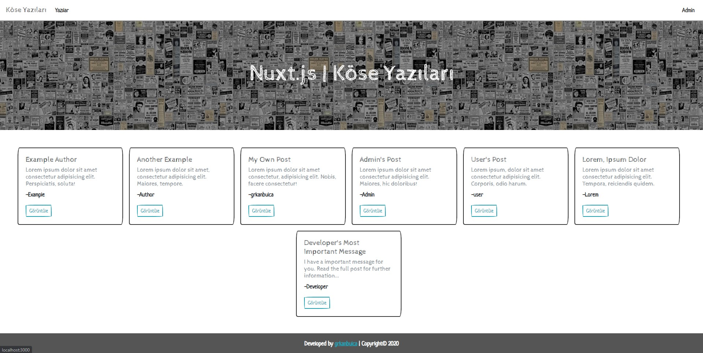
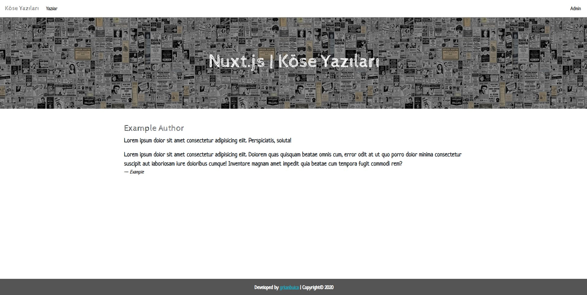
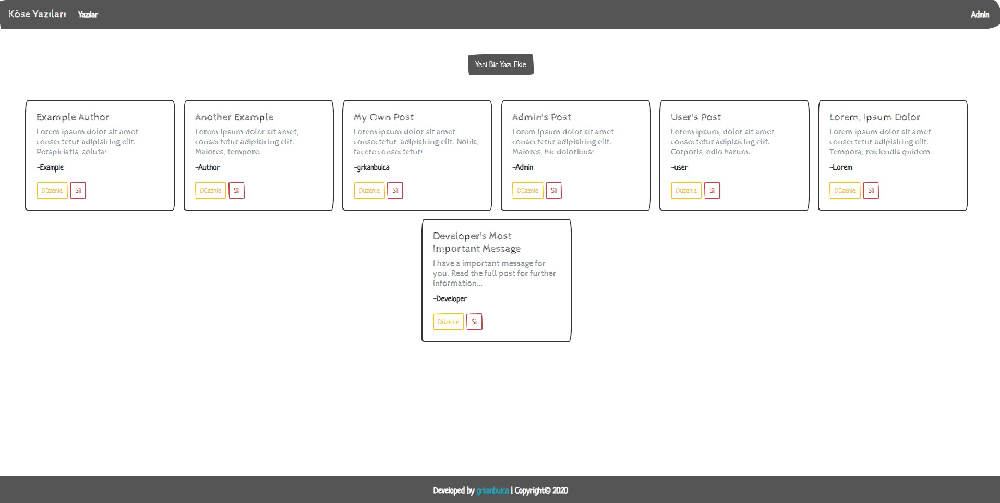
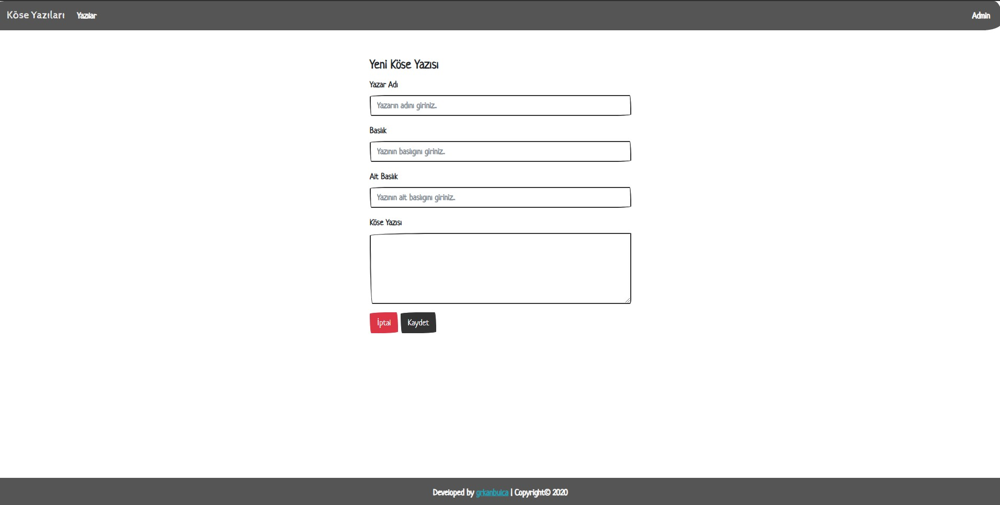
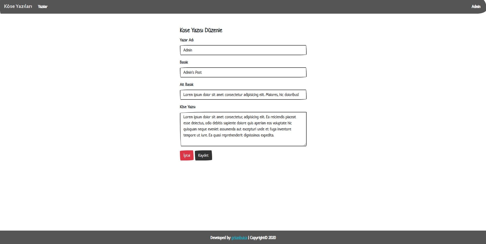

# Corner Posts
> Full-stack nuxt.js project.

## Core Technologies
> Html, Css, Js, Node.js, Vue.js, Nuxt.js

## Plugins
> axios, vuex, vue-router, bootstrap

## Database
> Google Firebase

## Build Setup

``` bash
# install dependencies
$ yarn install

# serve with hot reload at localhost:3000
$ yarn dev

# build for production and launch server
$ yarn build
$ yarn start

# for link to database => create keys.js under private folder and insert
export const DB_URL = [FIREBASE_URL];
```

## Previews
> Homepage


> Post Details


> Admin Homepage


> New Post


> Edit Post



